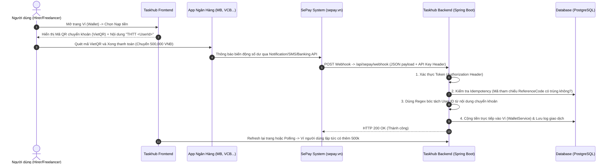

# TỔNG HỢP VÀ HƯỚNG DẪN TÍCH HỢP SEPAY vào TASKHUB (AUTO-BANKING WEBHOOK)

 Tài liệu này tổng hợp đầy đủ kiến trúc, luồng hoạt động, toàn bộ công việc đã thực hiện trên Backend / Frontend và hướng dẫn cấu hình chi tiết để duy trì tính năng Nạp tiền / Thanh toán tự động qua **SePay**.

---

## 1. Mục tiêu & Lý do Chuyển đổi
- **Loại bỏ MoMo / Cổng truyền thống**: Các cỗ máy thanh toán trực tuyến cũ yêu cầu hồ sơ đăng ký doanh nghiệp phức tạp, bảo trì SDK nặng nề và phát sinh c phí chiết khấu giao dịch cao.
- **Tích hợp SePay (sepay.vn)**: Giải pháp tự động lắng nghe biến động tài khoản ngân hàng (VietQR / Chuyển khoản trực tiếp) với tốc độ xử lý real-time (tối đa 2-5 giây) hoàn toàn không tốn phí trung gian, phù hợp với mọi mô hình ứng dụng hiện nay.

---

## 2. Kiến trúc & Luồng làm việc tự động (Workflow)



---

## 3. Các thay đổi & Cấu hình ở Backend (Spring Boot - Taskhub_BE)

Toàn bộ code backend cho SePay được phân lớp chu đáo và theo chuẩn Best Practices của Spring Boot:

### a. Entity & Database Preservation (Lưu vết Webhook)
- **[SepayWebhookLog.java](file:///d:/Code/Github/Taskhub/Taskhub_BE/BE/src/main/java/com/taskhub/entity/SepayWebhookLog.java)**: Bảng nhật ký ghi lại tất cả các request do SePay gửi về (Gateway, Số tiền, Số tài khoản, Raw JSON, Trạng thái xử lý).
- **[SepayWebhookLogRepository.java](file:///d:/Code/Github/Taskhub/Taskhub_BE/BE/src/main/java/com/taskhub/repository/SepayWebhookLogRepository.java)**: Hỗ trợ kiểm tra transaction đã từng được xử lý hay chưa thông qua `findByReferenceNumber`.

### b. Configuration & YAML Fix
- **[SepayProperties.java](file:///d:/Code/Github/Taskhub/Taskhub_BE/BE/src/main/java/com/taskhub/config/SepayProperties.java)**: Lớp mapping cấu hình tự động cho tiền tố `sepay.*` (`gateway`, `accountNumber`, `accountName`, `apiToken`, `webhookUrl`).
- **[application.yml](file:///d:/Code/Github/Taskhub/Taskhub_BE/BE/src/main/resources/application.yml) & [.env](file:///d:/Code/Github/Taskhub/Taskhub_BE/BE/.env)**:
  - Cập nhật đủ biến cho kết nối SePay.
  - Xử lý triệt để cảnh báo YAML do ký tự đặc biệt trong tên key cấu hình, giúp Spring Boot khởi động mượt mà không log cảnh báo đỏ.

### c. Service Layer & Logic nghiệp vụ ([SepayService.java](file:///d:/Code/Github/Taskhub/Taskhub_BE/BE/src/main/java/com/taskhub/service/SepayService.java))
Đây là "trái tim" của hệ thống nạp tiền:
1. **Bảo mật Webhook:** Hàm `verifySecurityToken` kiểm tra `Authorization` header gởi lên từ SePay.
2. **Xử lý Mã tham chiếu (Reference Code):** Đảm bảo gán `final` cho biến (fix lỗi compiler dùng trong Lambda), áp dụng chiến lược dự phòng tự sinh mã `SEPAY_ + ID` hoặc Timestamp nếu giao dịch của ngân hàng không có `referenceCode`.
3. **Idempotency (Chống nạp 2 lần):** Kiểm tra cẩn thận trạng thái `PROCESSED` của từng mã `refCode`.
4. **Bóc tách User ID bằng Regex:** Dùng biểu thức chính quy tối ưu:
   ```java
   Pattern USER_ID_PATTERN = Pattern.compile("(?i)(?:TASKHUB|THTT)\\s*(?:USER|U)?\\s*(\\d+)");
   ```
   *Hỗ trợ đa dạng cú pháp khách ghi chép như:* `THTT 105`, `thtt 105`, `TASKHUB 105`, `THTTUSER105`...
5. **Cộng số dư Ví:** Gọi sang `WalletService` để thực hiện giao dịch ghi nợ/góp nạp tiền `INWARD` cực kỳ an toàn trong một `@Transactional`.

### d. Web & Security endpoints
- **[SepayController.java](file:///d:/Code/Github/Taskhub/Taskhub_BE/BE/src/main/java/com/taskhub/controller/SepayController.java)**: Cung cấp Webhook cho SePay gọi vào (`POST /api/sepay/webhook`) và các endpoint cho Frontend lấy cấu hình mã Ngân Hàng hiển thị QR (`GET /api/sepay/config`).
- **[SecurityConfig.java](file:///d:/Code/Github/Taskhub/Taskhub_BE/BE/src/main/java/com/taskhub/security/SecurityConfig.java)**: Cấu hình cho phép endpoint Webhook của SePay truy cập public (không cần kèm JWT Token của User) do Server-to-Server gọi trực tiếp qua hệ thống xác thực API Key riêng.

---

## 4. Các thay đổi ở Frontend (Taskhub_FE)

- **Gỡ bỏ trọn vẹn MoMo:** Dọn dẹp tất cả đoạn mã thừa, thư viện cũ, API calls và giao diện thanh toán MoMo cồng khánh.
- **Tích hợp giao diện Quét VietQR mới ([hirer.wallet.tsx](file:///d:/Code/Github/Taskhub/Taskhub_FE/src/routes/hirer.wallet.tsx)):**
  - Giao diện trực quan hiển thị thông tin ngân hàng thụ hưởng, số tài khoản, QR Code VietQR động có sẵn số tiền và nội dung `THTT <UserId>`.
  - Khách hàng có thể trải nghiệm nạp tiền "chạm và quét" từ bất kỳ ứng dụng ngân hàng nào.

---

## 5. Hướng Dẫn Thiết Lập Webhook Trên Portal SePay (sepay.vn)

Để kết nối môi trường thực tể (Production / Local Staging), làm theo bước bên dưới:

1. Truy cập [sepay.vn](https://my.sepay.vn), đăng nhập tài khoản và kết nối số tài khoản ngân hàng nhận tiền của bạn.
2. Vào mục **Tích hợp -> Webhook**:
   - **URL Webhook:** Cấu hình trỏ tới tên miền API của hệ thống:
     `https://your-domain.com/api/sepay/webhook` 
     *(Nếu test local qua ngrok, thay bằng `https://abc-xyz.ngrok-free.app/api/sepay/webhook`)*
   - **Phương thức:** Chọn `POST`
   - **Định dạng dữ liệu:** Chọn `JSON`
3. Cấu hình bảo mật (Xác thực API):
   - Copy mã **API Token / Secret Key** của bạn ở SePay Portal.
   - Đưa mã này vào biến môi trường `.env` hoặc file cấu hình ở Backend (ví dụ `sepay.apiToken=YourSePaySecretKey Here...`).
4. **Kiểm tra thử:** Bấm nút "Gửi test webhook" ngay trên giao diện SePay Portal và kiểm tra log trong console Spring Boot Backend của Taskhub để chiêm ngưỡng tiền được auto-load vào ví!

---
*Tài liệu được khởi tạo ngày: 04/08/2026 bởi Antigravity AI Assistant.*
